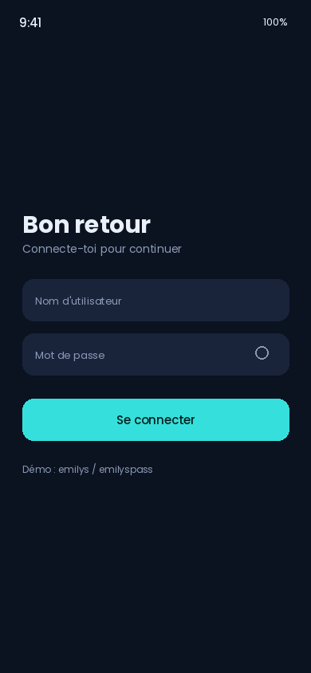
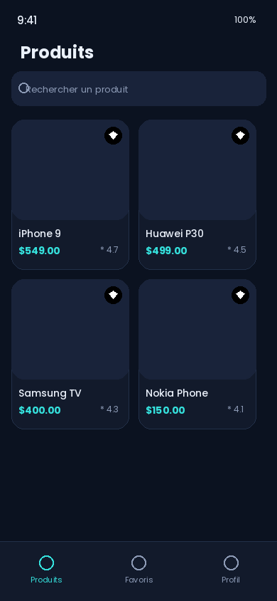
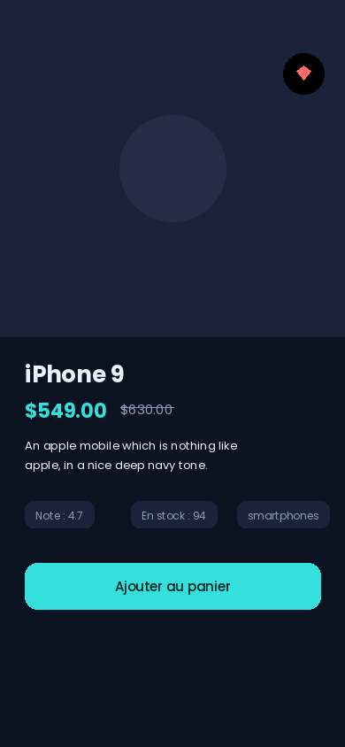

# TechMarket


Application e-commerce Flutter **production-ready**, connectée en direct à
l'API [DummyJSON](https://dummyjson.com), construite en Clean Architecture
avec Riverpod, testée de bout en bout et livrée avec un pipeline CI/CD
complet.

<p align="center">
  
  
  
</p>

> Les captures d'écran ci-dessus sont des emplacements à remplacer — voir
> [Captures d'écran](#captures-décran).

## Sommaire

- [Fonctionnalités](#fonctionnalités)
- [Architecture](#architecture)
- [Stack technique](#stack-technique)
- [Installation](#installation)
- [Lancer l'application](#lancer-lapplication)
- [Tests](#tests)
- [CI/CD](#cicd)
- [Performance](#performance)
- [Accessibilité](#accessibilité)
- [Internationalisation](#internationalisation)
- [Captures d'écran](#captures-décran)

## Fonctionnalités

- **Authentification JWT** contre `/auth/login`, tokens stockés dans le
  keystore/keychain via `flutter_secure_storage`, restauration de session
  automatique au démarrage.
- **Catalogue produits** avec pagination infinie, pull-to-refresh et
  recherche en temps réel (`/products/search`).
- **Détail produit** : galerie, prix remisé, note, stock, catégorie.
- **Favoris** persistés localement (`SharedPreferences`), synchronisés
  entre la grille, le détail et l'onglet dédié.
- **Profil** : informations utilisateur, bascule de langue FR/EN,
  déconnexion.
- **6 écrans** : splash, connexion, liste produits, détail produit,
  favoris, profil.

## Architecture

Clean Architecture en **feature-first**, trois couches par fonctionnalité :

```
lib/
├── core/                     # transverse : réseau, storage, thème, router, l10n, widgets partagés
└── features/
    ├── auth/
    │   ├── data/              # models (JSON), datasources (Dio), repository impl
    │   ├── domain/             # entities, repository interface, use cases
    │   └── presentation/       # providers (Riverpod), screens, widgets
    ├── products/                # même découpage
    ├── favorites/
    ├── profile/
    └── splash/
```

Règle de dépendance : `presentation` → `domain` ← `data`. Le domaine ne
connaît ni Dio ni Riverpod ni Flutter — il ne dépend que de ses propres
entités et interfaces, ce qui rend chaque couche testable indépendamment
(voir [Tests](#tests)).

La gestion des erreurs passe par un type `Result<T>` scellé
(`Ok`/`Err`) plutôt que des exceptions non typées, pour forcer chaque
appelant à traiter explicitement le cas d'échec.

## Stack technique

| Domaine | Choix |
|---|---|
| State management | `flutter_riverpod` + `hooks_riverpod` |
| Navigation | `go_router` (redirections auth, `ShellRoute`) |
| Réseau | `dio` + intercepteur JWT |
| Stockage sécurisé | `flutter_secure_storage` |
| Stockage local | `shared_preferences` |
| Images | `cached_network_image` |
| Formulaires/perf | `flutter_hooks` |
| i18n | `flutter_localizations` + ARB (FR/EN) |
| Tests | `flutter_test`, `mocktail`, `integration_test` |

## Installation

Ce dépôt est développé **entièrement depuis un téléphone Android** via
Termux (pas de SDK Flutter local) — toute compilation/test réelle se fait
via GitHub Actions. Si tu as un poste avec le SDK Flutter installé :

```bash
flutter pub get
flutter gen-l10n
flutter create --platforms=android .   # génère le dossier android/ (gitignored)
```

## Lancer l'application

```bash
flutter run
```

Identifiants de démonstration DummyJSON :

```
utilisateur : emilys
mot de passe : emilyspass
```

## Tests

```bash
# Unitaires + widgets
flutter test --coverage

# Intégration (nécessite un appareil/émulateur connecté + réseau)
flutter test integration_test
```

Couverture actuelle :

| Type | Quantité | Emplacement |
|---|---|---|
| Tests unitaires | 36 (10 fichiers) | `test/unit/` (auth, products, favorites, core) |
| Tests widgets | 13 (5 fichiers) | `test/widget/` |
| Tests d'intégration | 2 | `integration_test/` |

*(Minimums de la consigne : 10 unitaires / 5 widgets / 2 intégration — tous largement dépassés.)*

## CI/CD

Le workflow `.github/workflows/ci.yml` s'exécute sur chaque push/PR vers
`main` :

1. `dart format --set-exit-if-changed` — refuse tout code mal formaté.
2. `flutter analyze --fatal-infos` — zéro warning toléré.
3. `flutter test --coverage` — tests unitaires + widgets, rapport de
   couverture uploadé en artefact.
4. `flutter build apk --release` — build de démonstration uploadé en
   artefact téléchargeable depuis l'onglet *Actions*.

## Performance

- `flutter_hooks` évite les `StatefulWidget` et leurs rebuilds superflus
  pour la gestion des formulaires et du scroll.
- Widgets `const` systématiques (`ProductCard`, indicateurs, chips).
- `cached_network_image` avec `memCacheWidth` pour limiter la mémoire
  utilisée par les miniatures.
- Pagination + lazy loading (`GridView.builder`) : seuls les éléments
  visibles sont construits.
- Mise à jour optimiste des favoris (l'UI réagit avant la confirmation
  du stockage local).

## Accessibilité

Chaque élément interactif (champs de formulaire, boutons, cartes
produit, icônes de favoris, navigation) est enveloppé dans un widget
`Semantics` avec un label explicite, testé dans `test/widget/core/`.

## Internationalisation

Support FR (par défaut) et EN via ARB (`lib/core/l10n/app_fr.arb`,
`app_en.arb`), bascule accessible depuis l'écran Profil et persistée en
local.

## Captures d'écran

Remplace les fichiers dans `docs/screenshots/` par tes propres captures
avant la soumission finale (`login.png`, `products.png`, `detail.png`).
